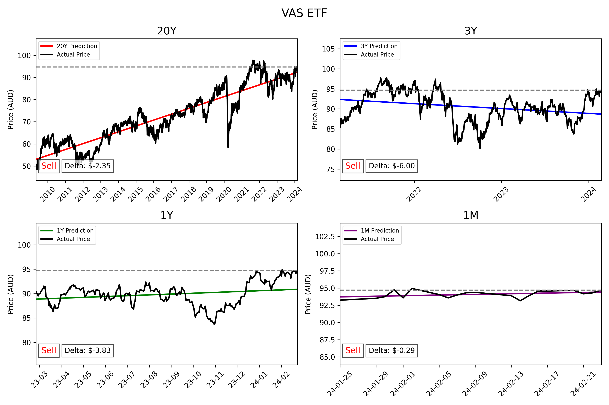

# Should I buy VAS?
## (larping as a someone who knows about finance)



Getting Started
To run this script, you will need Python installed on your system.

Installation
bash
```
pip install -r requirements.txt
```
Running the Script
bash
```
python main.py
```

How It Works

Fetches historical price data for VAS using the yfinance library.
Converts dates into a numeric format suitable for linear regression.
Fits linear regression models for the specified timespans.
Predicts prices using these models and compares them to the actual current price.
Generates and saves a set of plots showing these comparisons.
